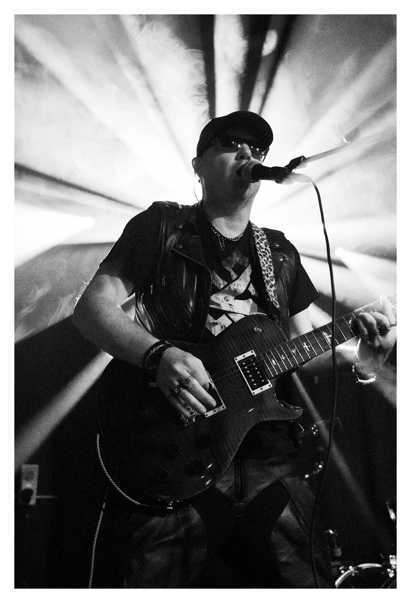
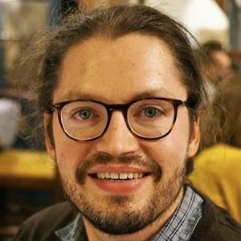
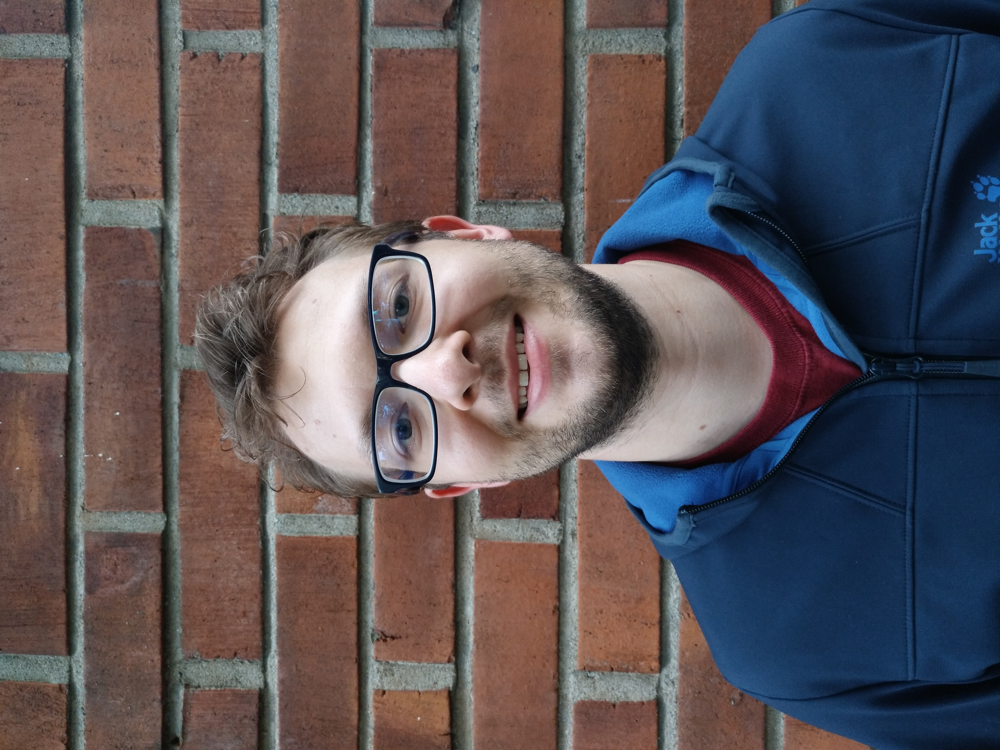
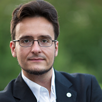

# Invited Speakers

## [Bob Coecke](https://en.wikipedia.org/wiki/Bob_Coecke) (keynote)

<table class="no-border">
  <tbody>
    <tr>
      <td style="vertical-align:top">
<strong>TBA</strong>

 

      </td>
      <td style="width:60px;vertical-align:top;">
        

          
        

      </td>
    </tr>
  </tbody>
</table>

## [Yu-Fang Chen](https://guluchen.github.io/)

<table class="no-border">
  <tbody>
    <tr>
      <td style="vertical-align:top">
<strong>Automata-Based Verification of Size-Parameterized Quantum Circuits</strong>

 

This talk focuses on how the automata structure in the quantum program verifier AutoQ has evolved, and how these changes enable the verification of size-parameterized quantum circuits. I will explain the motivation behind the new automata design, outline the resulting increase in expressiveness, and discuss what classes of parameterized circuits can now be handled, as well as current limitations.
      </td>
      <td style="width:60px;vertical-align:top;">
        

          
        

      </td>
    </tr>
  </tbody>
</table>

## [Johannes Klaus Fichte](https://liu.se/en/employee/johfi52)

<table class="no-border">
  <tbody>
    <tr>
      <td style="vertical-align:top">
<strong>TBA</strong>

 

      </td>
      <td style="width:60px;vertical-align:top;">
        

          
        

      </td>
    </tr>
  </tbody>
</table>

## [Markus Hecher](https://dbai.tuwien.ac.at/staff/hecher/)

<table class="no-border">
  <tbody>
    <tr>
      <td style="vertical-align:top">
<strong>TBA</strong>

 

      </td>
      <td style="width:60px;vertical-align:top;">
        

          
        

      </td>
    </tr>
  </tbody>
</table>

## [Kuldeep Meel](https://www.cs.toronto.edu/~meel/)

<table class="no-border">
  <tbody>
    <tr>
      <td style="vertical-align:top">
<strong>TBA</strong>

 

      </td>
      <td style="width:60px;vertical-align:top;">
        

          
        

      </td>
    </tr>
  </tbody>
</table>

## [Christopher Vasko](https://www.iafastro.org/biographie/christopher-vasko.html)

<table class="no-border">
  <tbody>
    <tr>
      <td style="vertical-align:top">
<strong>TBA</strong>

 

      </td>
      <td style="width:60px;vertical-align:top;">
        

          
        

      </td>
    </tr>
  </tbody>
</table>
