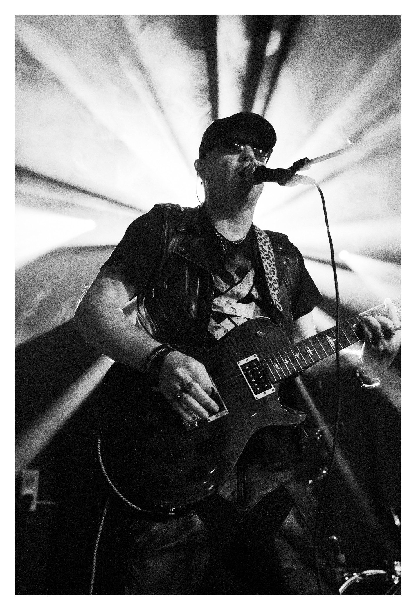
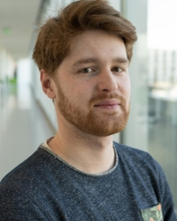
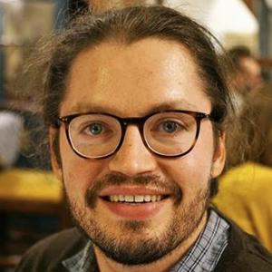
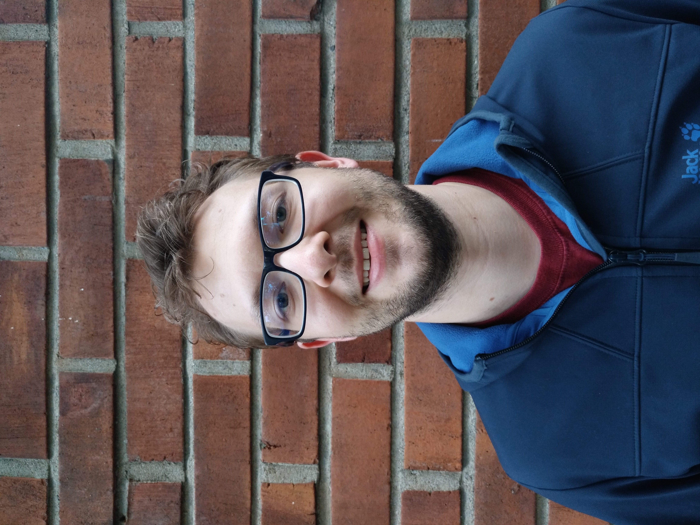

# Invited Speakers

## [Bob Coecke](https://www.cs.ox.ac.uk/people/bob.coecke/) (keynote)

<table class="no-border">
  <tbody>
    <tr>
      <td style="vertical-align:top">
<strong>From quantum in pictures to interpretable and scalable quantum AI</strong>

 

Over some 20 years we have developed a compositional quantum formalism, called categorical quantum mechanics or quantum picturalism.  We showed that this enabled secondary school students to perform exceptional on an Oxford University post-grad quantum exam.  The same formalism has been used as the basis for a compositional interpretable formalism for NLP, and AI more generally.
      </td>
      <td style="width:60px;vertical-align:top;">
        

          
        

      </td>
    </tr>
  </tbody>
</table>

## [Yu-Fang Chen](https://guluchen.github.io/)

<table class="no-border">
  <tbody>
    <tr>
      <td style="vertical-align:top">
<strong>Automata-Based Verification of Size-Parameterized Quantum Circuits</strong>

 

This talk focuses on how the automata structure in the quantum program verifier AutoQ has evolved, and how these changes enable the verification of size-parameterized quantum circuits. I will explain the motivation behind the new automata design, outline the resulting increase in expressiveness, and discuss what classes of parameterized circuits can now be handled, as well as current limitations.
      </td>
      <td style="width:60px;vertical-align:top;">
        

          
        

      </td>
    </tr>
  </tbody>
</table>

## [Tim Coopmans](https://timcoopmans.com/)

<table class="no-border">
  <tbody>
    <tr>
      <td style="vertical-align:top">
<strong>Minimal-size decision diagrams for quantum-circuit simulation</strong>

 

Representing quantum states as decision diagrams can make quantum-circuit simulation significantly faster. In this talk, I will focus on Local-Invertible Map Decision Diagrams and discuss the impact of making such decision diagrams as small as possible by using an algorithm to bring the decision diagram into normal form.
      </td>
      <td style="width:60px;vertical-align:top;">
        

          
        

      </td>
    </tr>
  </tbody>
</table>

## [Johannes Klaus Fichte](https://liu.se/en/employee/johfi52)

<table class="no-border">
  <tbody>
    <tr>
      <td style="vertical-align:top">
<strong>Model Counting: Solving, Complexity, and Applications</strong>

 
In this talk, I will consider model counting, which asks to output the number of solutions to a given input instance. I will present recent complexity results and a solving approach that employs structural parameters (treewidth) for faster solving. While the algorithm provides a theoretical bound, a direct implementation is, unsurprisingly, practically infeasible. Therefore, we turn our attention to a more practical exploitable direction. Finally, I will illustrate practical applications of counting to analyze and navigate solution spaces, including directions that focus on counting for decision spaces rather than entire solution spaces, significantly improving complexity.
      </td>
      <td style="width:60px;vertical-align:top;">
        

          
        

      </td>
    </tr>
  </tbody>
</table>

## [Markus Hecher](https://dbai.tuwien.ac.at/staff/hecher/)

<table class="no-border">
  <tbody>
    <tr>
      <td style="vertical-align:top">
<strong>New Insights into the Power of Arithmetic for Counting Complexity</strong>

 

In this talk we show recent insights into fine-grained counting complexity. While it is well known that the problem of counting the models of a propositional formula in conjunctive normal form (#SAT) or in disjunctive normal form (#DNF) is complete for #P under Turing reductions, it turns out that we need very little computational resources from Turing reductions. Indeed, it turns out that a single #2DNF call is enough for hardness, as long as we have additional resources well-below P.
      </td>
      <td style="width:60px;vertical-align:top;">
        

          
        

      </td>
    </tr>
  </tbody>
</table>
